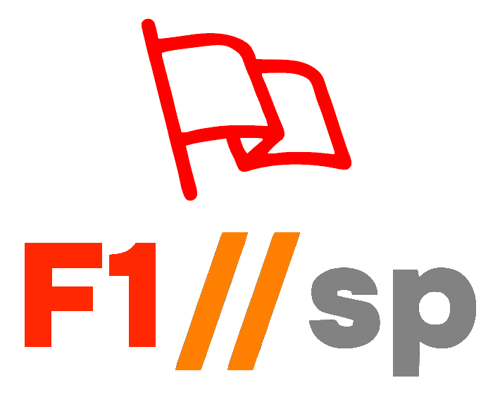

<!-- MD033 ignore -->
<!-- Improved compatibility of back to top link: See: https://github.com/othneildrew/Best-README-Template/pull/73 -->

# Formula 1 Statistics Portal (F1SP)



A comprehensive Formula 1 statistics portal built with React and TypeScript. Connected to the very awesome <a href="https://www.github.com/f1db/f1db/" target="_blank" rel="noreferrer">F1DB</a>.

## 🏎️ Live App

[View](https://f1db.app) <!-- Replace with your actual Azure Static Web App URL -->


## 📋 Features

- **Comprehensive F1 Data**: Access to historical race data, driver statistics, and constructor information
- **Real-time Updates**: Latest race results and standings
- **Interactive UI**: Modern, responsive design with dark/light mode support
- **Data Visualization**: Charts and graphs for statistical analysis
- **Azure Data API Integration**: Fast and reliable data access
- **Mobile-Friendly**: Optimized for all device sizes

## 🛠️ Technology Stack

- **Frontend**: React, TypeScript, Redux Toolkit
- **UI Components**: Custom components with TailwindCSS
- **Data Fetching**: RTK Query with Azure Data API
- **Hosting**: Azure Static Web Apps
- **Database**: Azure SQL (accessed via Azure Data API)
- **Authentication**: None, yet.

## 🚀 Getting Started

### Prerequisites

- Node.js (v16 or later)
- npm or yarn
- Azure CLI (for deployment)
- Azure Static Web Apps CLI (for local development)
- Azure Data API connections

### Local Development

***NOTE!*** Azure is not a required piece of this puzzle. During the first 6+ months of casual development, I was running with Docker and Postgres and before Postgres.... SQLite 😲! As I have time, I'll add instructions for those flavors.

1. Clone the repository:

   ```bash
   git clone <repository-url>
   cd _f1sp
   ```

2. Install dependencies:

   ```bash
   npm install
   # or
   yarn
   ```

3. Set up local environment:

   ```bash
   # Create .env file with necessary variables
   cp .env.example .env
   ```

4. Run the development server:

   ```bash
   npm run dev
   # or
   yarn dev
   ```

5. To test Azure Data API connections locally:

   ```bash
   npm run swa:start
   # or
   yarn swa:start
   ```

## 🌐 Azure Deployment

### Azure Static Web Apps Deployment

1. Set up Azure resources:

   ```bash
   az group create --name f1sp-rg --location eastus
   ```

2. Deploy using GitHub Actions (recommended):
   - Connect your GitHub repository to Azure Static Web Apps in the Azure Portal
   - Configure your deployment settings
   - The GitHub workflow will handle the rest

3. Deploy manually using Azure CLI:

   ```bash
   swa deploy ./dist --app-name f1sp --deployment-token <your-deployment-token>
   ```

### Azure Data API Configuration

Database connections are configured in the `swa-db-connections/staticwebapp.database.config.json` file. Ensure your Azure SQL database is properly set up and accessible.

## 📊 Project Structure

- `/src` - Source code
  - `/app` - Redux store
  - `/assets` - Static assets
  - `/components` - UI components
  - `/constants` - Application constants
  - `/features` - API endpoints and RTK Query services
  - `/hooks` - Custom React hooks
  - `/routes` - Application pages
  - `/slices` - Redux slices
  - `/types` - TypeScript types
  - `/utils` - Utility functions

- `/db` - SQL queries for Azure Data API
- `/swa-db-connections` - Azure Static Web Apps database connection configuration

## 🚧 Development Workflow

1. Create a feature branch from `main`
2. Implement your changes
3. Write or update tests
4. Create a pull request
5. Merge to `main` after review
6. Automatic deployment via GitHub Actions

## 🔒 Security Considerations

- Azure Data API connections use managed identities for secure access
- No credentials are stored in the codebase
- All API requests are validated and sanitized
- CORS is properly configured in Azure Static Web Apps

## 📝 Contributing

Contributions are welcome! Please feel free to submit a Pull Request.

## 📄 License

This project is licensed under the terms of the license included in the [LICENSE](LICENSE) file.

## 📞 Support

In general, this is offered as is, with no warranty. That said, if you need help figuring an issue. Or just have general questions, let me know <a href="mailto:dah007@me.com">email me</a>.
